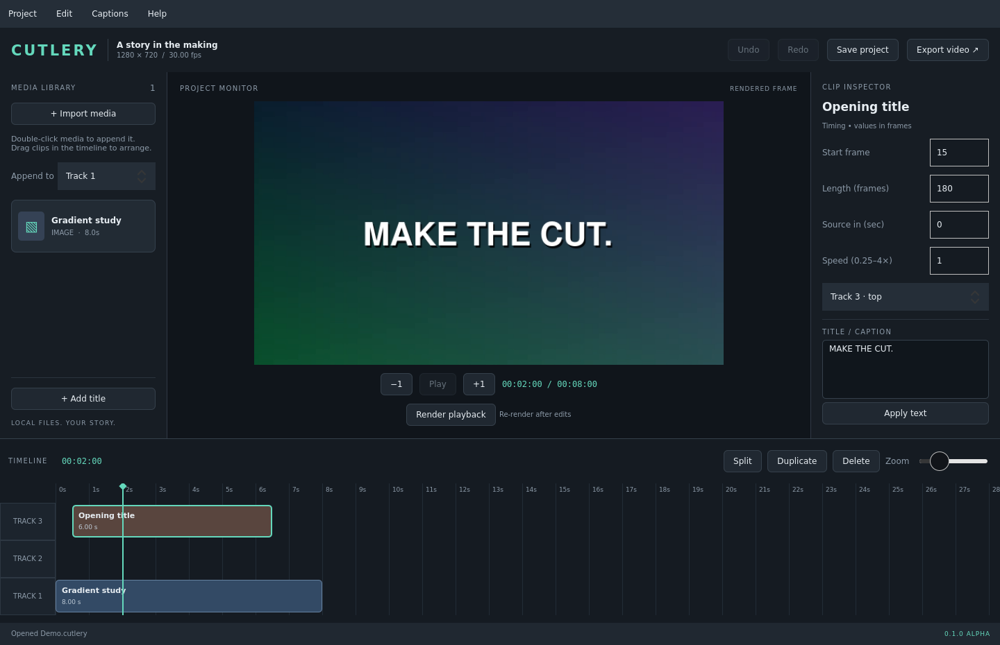

# Cutlery

An original, local desktop video editor for Windows. **Version 0.4.0 is a functional alpha, not the completed 187-feature roadmap.** Built with C++20, Qt Quick 6.8 and a shared FFmpeg reference renderer.



## Try it on Windows

Open [Actions → Windows portable build](https://github.com/HNXS/Cutlery/actions/workflows/windows.yml), select a successful run, and download **Cutlery-0.4.0-win64-portable** from its artifacts. Extract the entire ZIP into a writable folder and run `Cutlery.exe`. The package is unsigned. No account, service, telemetry or model download is required by the application.

1. Drop local video, audio or image files into the media library, or directly onto a timeline track. Drag library items to the desired track/time. Double-click still appends to the chosen track.
2. Add tracks with **+ Track**. Drag video, audio, images or titles along a track or between tracks; drag near the viewport edges to scroll. Escape cancels. Higher tracks appear on top. Free tracks allow overlaps in insertion order.
3. Each track has **Snap** (align edges while dragging) and **Magnet** (keep clips together from frame 0). Enabling Magnet closes existing gaps/overlaps; Undo restores them. Other tracks retain their timing. Drag either clip edge to trim. Double-click a clip to seek its start; click the timeline to seek elsewhere. Split at the playhead, duplicate, delete, or adjust exact frame ranges in the inspector.
4. Add titles, edit their text and click **Apply text**. Import SRT to create editable, burned-in captions.
5. Adjust crop, position, scale, rotation, opacity, colour, speed, reverse, volume and fades. Changes are nondestructive.
6. Click **Play** or press **Space** with the timeline focused. Playback starts immediately from the playhead; nothing is rendered in advance. Space pauses/resumes. Editing while playing applies the change and keeps playing. Previews, playback and exported files use the same composition compiler.
7. Save a `.cutlery` project. **Export video** writes a new MP4, WebM or MOV. Pick a preset such as "YouTube (best quality, 4K upload)", or choose format, quality and resolution yourself. Keep your source media; the project references those files.

## What works

- Up to 64 named tracks with independent snapping/magnetic mode, lock, audio mute/solo, and picture visibility; frame-based edit coordinates and rational source time.
- Library-to-track and Windows file drag/drop with insertion feedback; multiple dropped files are imported and placed in order. Invalid files are reported while valid files remain usable.
- Media probing/import and relinking; project presets; atomic JSON saves; single recovery snapshot; 60-step undo/redo.
- Split, draggable edge trims, inspector trims, move, duplicate, delete, track-local ripple delete; snapping to clip edges, the playhead and timeline start.
- Detach video audio onto its own track; cached mono waveform overviews that follow trims, speed and reverse.
- Filmstrip thumbnails on video and image clips that follow trims, speed and reverse, plus poster frames in the media library. They are extracted in the background from keyframes and cached per file.
- 30 configurable keyboard commands with conflict checks and portable preferences. Open **Help → Keyboard shortcuts** or press **Ctrl+/**; see the [shortcut reference](docs/SHORTCUTS.md).
- 14 transitions between touching clips on a track: dissolve, dips to black/white, wipes, slides, zoom, circle, radial and pixelize. Click **+** on a cut or use the inspector; duration 0.1–3 s. Audio crossfades automatically. Clips keep their timing; each extends into the other using spare source media, or holds its edge frame.
- Keyframe animation of scale, position, rotation, opacity and volume. Put the playhead in the clip and click ◇ next to a slider. Once a property has keyframes, moving its slider at another time adds a keyframe there. Keyframes show as yellow diamonds on the clip; click one to jump there, or use ◀◆ / ◆▶.
- Static transforms, equal-edge crop, horizontal flip, opacity, brightness/contrast/saturation, clip fades.
- Constant speed **0.25–4×**, reverse, volume/mute, stereo mixing with an output limiter.
- Rasterized Unicode titles, manual captions, SRT import/export and subtitle burn-in.
- Live playback that starts in a fraction of a second, audio-clocked with frame skipping when the CPU falls behind; preview frames that render only the playhead frame; export progress and cancellation.
- Export presets and controls: H.264, HEVC and AV1 in MP4, VP9 in WebM, ProRes 422 HQ in MOV, legacy MPEG-4; four quality levels; project size up to 4K. Cutlery tries NVIDIA NVENC, AMD AMF, Intel Quick Sync, then Windows Media Foundation, and uses the first that passes a short test encode. AV1 (SVT-AV1), VP9 and ProRes also work in software. Exports use Lanczos scaling, and higher resolutions re-render each source at that size.
- Original Cutlery app icon embedded in the Windows executable and used by the app window/taskbar.
- Windows portable packaging, pinned codec download with checksum, dependency notices, and render regression tests.

## Boundaries of this alpha

This is a CPU reference implementation. It does **not** yet implement the planned D3D11/WASAPI real-time engine, proxies, multilevel waveform pyramids, a keyframe graph editor, easing curves, masks, tracking, HDR colour management, hardware qualification, offline AI, transcription, an installer, or project-media collection. Heavy multi-layer timelines can drop frames during playback on the CPU renderer. Reversed clips decode their whole visible range before playing, so long reversed clips start slowly. The UI is not yet an accessibility-qualified release.

Only finite local media files are supported. Source audio/video remain together until you use **Detach audio**; detached clips can then be edited independently. Relinking or resynchronizing detached pairs is not implemented. Timing is rounded to sequence frames; SRT timing is quantized on import. Colour operations are simple SDR adjustments, not a colour-managed grading pipeline. Output filenames must be new; exports never overwrite an existing file. Temporary render folders live under `cache`; remove it while Cutlery is closed if space is needed.

The current development build saves schema 5, which adds transitions and keyframes; 0.4 and older cannot open it. It reads all earlier schemas. Use **Save As** to preserve an older project copy.

See [what remains](docs/ROADMAP.md), [drag/drop and magnetic tracks](docs/TIMELINE.md), [BUILDING](docs/BUILDING.md), [PORTABLE](docs/PORTABLE.md), [architecture](docs/ARCHITECTURE.md), [feature status](docs/FEATURE_STATUS.md), [the original blueprint](docs/BLUEPRINT.md), and [third-party notices](docs/THIRD_PARTY.md).

## Development

```powershell
cmake -S . -B build -G "Visual Studio 17 2022" -A x64 -DCMAKE_PREFIX_PATH=C:/Qt/6.8.3/msvc2022_64
cmake --build build --config Release --parallel 2
ctest --test-dir build -C Release --output-on-failure
```

Qt 6.8.3 (Core, Gui, Quick, QuickControls2, Multimedia, Test), MSVC 2022, CMake ≥3.24, FFmpeg and ffprobe are required. See the build guide for environment setup and packaging. The project has no application-wide open-source licence selected yet; dependency licences remain separate.
