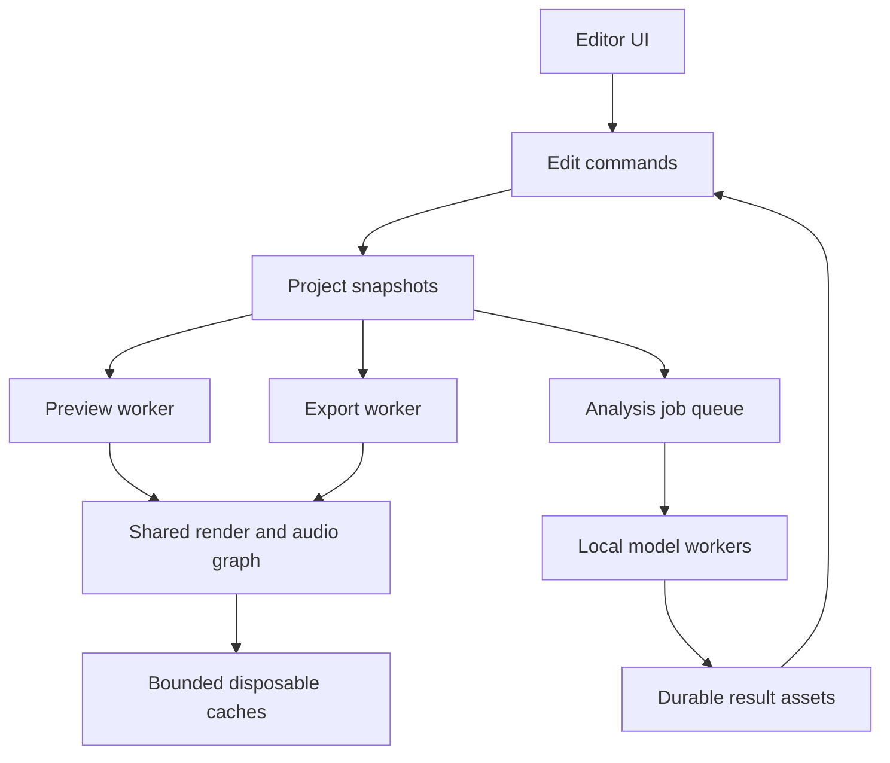
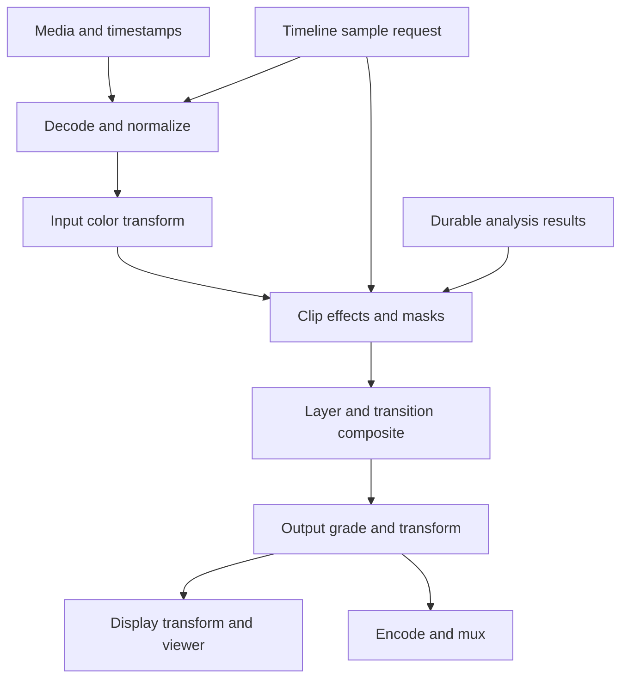

# Local Windows Video Editor — Engineering Blueprint

**For Tim Heineccius • 28 September 2026 • Architecture review, version 0.1**

**Recommendation:** build an original Windows x64 editor around C++20, Qt Quick, a shared Direct3D 11 render graph, controlled FFmpeg libraries, WASAPI audio and optional local inference workers. Deliver a portable folder from the first engineering milestone. Ship a useful editor before undertaking the largest AI features.

This is a design, not an implemented or benchmarked application. No application source code, executable, model download or deployment has been produced. Implementation stops here for architecture review, as required by the supplied brief, sections 36–37.

The companion **Windows_Video_Editor_Feature_Matrix.xlsx** contains the detailed implementation inventory, priorities, dependencies, risks, phases and acceptance criteria. Its status fields distinguish planned work, investigations and exclusions. A planned feature is not a working feature.

## A. Executive architecture

### Product boundary

The target is a local editor with the creative capabilities associated with CapCut Windows, including premium editing categories, without accounts, subscriptions or online services. It includes original effects/templates, local captions, tracking, background removal and other feasible local AI. It does not include CapCut's assets, source code, private interfaces, proprietary models or branding.

The report in **Eingefügter Text(1).txt** is reference R1. The engineering brief in **Eingefügter Text (2).txt** is R2. R1's C/T/A/L/K/G identifiers are retained in the workbook. `REQ n` refers to section n of R2. Proposed additions are requirements from R2, not claims that a specific CapCut Windows build supports them. The research report's opaque citation tokens cannot independently establish its claims in this conversation. Selected important facts were checked against primary sources listed at the end.

Do not carry the report's cross-platform staffing estimates, cloud architecture, analytics or entitlement system into this product. Do not infer that every generative capability is fundamentally cloud-only. Some can run locally, but model rights, Windows support, quality, memory and speed remain real feasibility gates.

### Decisions proposed for approval

| Area | Proposed decision | Consequence |
|---|---|---|
| UI and application | C++20 + Qt Quick/QML; C++ timeline geometry and models | QML handles presentation. It does not schedule frames or process media. |
| Editing model | Original command-driven C++ domain model | All edits are nondestructive, transactional and undoable. |
| Media | Dynamically linked, controlled FFmpeg build; Windows codec adapters where useful | Broad format coverage with explicit codec/profile support and licensing. |
| Video rendering | D3D11 first; FP16 surfaces; WARP degraded CPU mode | One graph serves preview and export. D3D12 is a later optimization, not a second required renderer. |
| Audio | WASAPI output/capture; own sample scheduler and mixer | Audio clock drives preview; deterministic sample counts drive export. |
| Text | DirectWrite shaping/layout; Direct2D glyph rasterization | Use the same glyph layout and font bytes for viewer and output. |
| AI | Process-isolated jobs; whisper.cpp for ASR; ONNX Runtime for qualified graphs | No Python installation required for the core editor. Large optional packs may carry a separately audited runtime. |
| Persistence | JSON manifest, durable derivatives and atomic snapshots | A cache can be deleted without deleting a user's generated media or edits. |
| Packaging | Same app in per-user installer and portable ZIP | No required service, driver installation, registry registration or network listener. |
| Distribution | Prefer replaceable LGPL DLLs and permissive components | App license can remain undecided during design; public redistribution requires the completed dependency audit. |

The renderer, audio engine, timeline, project format and job scheduler are libraries independent of Qt. The headless renderer consumes the same immutable project snapshot as preview. UI controls never become the authoritative representation of an effect or cut.

### Process and failure boundaries

The UI process owns commands, project snapshots and job orchestration. A media/render worker handles untrusted media parsing, decoding and rendering. A separate export worker receives a frozen project revision. AI workers receive explicit files/segments and produce durable result artifacts. Small audio DSP runs in the real-time audio path; expensive enhancement runs as analysis jobs.

Use named pipes for typed control messages and bounded shared-memory buffers for PCM/CPU frames. On compatible adapters, share D3D11 textures through explicit handles and synchronization. Do not assume texture sharing works across adapters or privilege boundaries: a measured copy path is the fallback. None of this needs a localhost HTTP server. Process isolation improves recovery; it is not a claim that arbitrary codecs or GPU drivers are securely sandboxed.



### Assumed hardware, pending actual PC specifications

These are test profiles and provisional targets, not minimum requirements already validated. The company laptop and home PC specifications are not supplied.

| Profile | Assumed configuration | Intended experience |
|---|---|---|
| L, managed laptop | Windows 11 x64, 4–8 modern CPU cores, 16 GB RAM, integrated GPU, SSD | 1080p editing; 4K sources through proxies; small speech models; heavy AI optional/offline batch. |
| D, editing desktop | Windows 11 x64, 8+ cores, 32 GB RAM, 8–12 GB VRAM, SSD | 4K editing with qualified codecs; faster analysis; selected vision packs. |
| H, AI workstation | 64 GB RAM, 16–24+ GB VRAM, large SSD | Experimental image/video generation packs and larger models. |
| C, software fallback | Same CPU class, 16 GB RAM, WARP/software decode | Lower-resolution preview, slow but correct export; no promise of real-time heavy effects. |

Windows 10 x64 is a secondary compatibility target only where the selected dependency versions and the organization's Windows support policy permit it. Test its exact OS build; do not infer support from Windows 11 success. CPU instruction-set capability, device drivers and system codec availability must be probed rather than assumed.

## B. Windows/local feature inventory and scope

### Traceability to every R1 feature family

| R1 IDs | Disposition and intended local behavior |
|---|---|
| C01–C06 | Projects/import, multitrack timeline, edit tools, transforms, speed/time remapping, keyframes and graphs. Required. |
| C07–C10 | Original transitions/effects, color controls and chroma key. Required. |
| C11–C15 | Stabilization, interpolation, tracking, reframing and cutout. Required categories, with model/backend quality gates. |
| C16 | Retouch is retained for investigation. The report does not establish complete Windows behavior. |
| C17 | Local canvas, backgrounds, compositions and collages. Required. |
| T01–T05 | Text/local fonts, manual subtitles, SRT/TXT import, local ASR, transcript edits, caption styles and animations. Required; advanced variants follow the core. |
| A01 | Optional offline TTS packs. Voice/language rights and frontend dependencies must be qualified. |
| A02 | DSP voice changer; local dubbing investigation; custom voice/conversion remains a separately gated optional pack. |
| A03–A04 | Mixing, recording, extraction, loudness, noise reduction, enhancement and local audio assets. Required. |
| L01 | Original local templates and replaceable slots. No online marketplace. |
| L02 | Own/licensed local assets and rights metadata. CapCut's premium library is excluded. |
| L03 | Metadata/dialogue search first; semantic/object search next; person indexing is optional investigation. |
| L04 | Editable short-video proposals from local scenes/transcripts and optional local ranking models. |
| L05 | Direct social publishing excluded. Local file export covers handoff. |
| L06 | Local import/conversion/compression/export; 4K and HDR only for tested combinations. |
| K01–K02 | Accounts, subscriptions, cloud storage, sync and cloud rendering excluded. |
| K03 | Online teamwork/review excluded; local brand styles and reusable templates retained. |
| G01–G04 | Local generation, writer/storyboard and editing assistance remain research/optional packs, not core dependencies. |
| G05–G06 | Avatar library/clone retained as investigation; no unqualified model selected for shipping. |
| G07 | Local layout solver is feasible; LLM suggestions optional. |
| G08–G10 | Photo editing, upscale, masks and image compositing feasible; advanced video inpainting needs research. |
| G11 | Original meme/sticker templates plus optional local raster generation; exact asset catalog excluded. |
| G12 | Upscale/denoise planned; learned relighting investigated separately. |
| G13 | Dialogue-scene semantics are insufficiently specified in R1; definition and local implementation remain open. |

CapCut's current desktop page confirms a broad mix of editing, captions, search and AI tools, but it does not establish a fixed, globally complete Windows feature list [S01]. The project therefore freezes a dated feature baseline before making a parity claim. “All features” cannot mean every future release, region experiment or proprietary template.

### What the supplied research does not settle

The exact Windows build/region tested, individual premium effect behavior, caption quotas, retouch availability, exact smart-search semantics, color/HDR transforms, codec profiles, keyboard behavior, template parameter models and G13 workflow remain uncertain. R1 often confirms a mobile feature while marking Windows partial or unspecified. Such rows remain research evidence rather than proof.

Before parity closure, create a Windows reference checklist using legally available documentation and ordinary observed workflows on an authorized installation. Record build/date, inputs, steps and expected outputs. No decompilation, asset extraction or undocumented service access is needed for this plan.

## C. Master feature matrix

The workbook is the authoritative detailed list for this blueprint. It includes all requested columns: Feature, Category, CapCut equivalent, Our implementation, Priority, Difficulty, CPU/GPU, External dependency, AI model, Offline, Portable, Phase and Acceptance criteria. Additional fields capture stable ID, scope, prerequisites, engineering/performance/licensing risks, status and requirement source.

Interpret the fields as follows:

| Field | Meaning |
|---|---|
| Required | Part of the intended product scope. Priority controls sequence, not eventual omission. |
| Optional | Separately installed capability, retained in the plan. Absence cannot block basic editing. |
| Investigate | Product intent retained; no implementation, quality, license or hardware promise yet. |
| Excluded | Outside the explicit local Windows scope, with a reason. |
| P0 / P1 / P2 / P3 | Fundamental editor / strong everyday experience / advanced capability / edge or research capability. |
| M / H / VH | Medium / high / very high relative engineering difficulty after shared foundations. Not person-month estimates. |
| Risk L / M / H | Architectural triage judgment; not a measured probability or legal conclusion. |
| Portable = Yes | Designed for folder deployment, conditional on Windows policy, writable selected storage and qualified dependencies. |

All applicable features inherit the common completion contract in section P. A row's acceptance test adds feature-specific evidence to that contract; it does not replace persistence, undo, error handling, preview/export and packaging tests. Estimate schedules at milestone level to avoid double counting shared work across rows.

## D. Technology decisions and alternatives

### UI and engine strategy

| Option | Performance/GPU and codecs | Size and portability | Integration/debugging | Maintenance/licensing | Decision |
|---|---|---|---|---|---|
| Qt Quick + C++ engine | Native media hot paths; direct GPU viewer integration | Moderate runtime; app-local deployment is documented | Mature tooling; custom timeline still substantial | LGPL module audit and replaceable DLLs, or commercial Qt | Preferred. |
| WinUI 3 + C++/WinRT engine | Native rendering possible; equivalent media engine needed | Self-contained unpackaged deployment exists; runtime/bootstrap details need testing | Strong Windows UI; composition/interop adds work | Windows App SDK and redistributable terms | Viable runner-up; not dismissed as inherently nonportable [S05]. |
| Qt Widgets + C++ | Good native integration; more work for animated/scalable canvas UX | Similar Qt deployment | Straightforward desktop debugging | Same module/license review | Backup if Quick viewer/virtualization spike fails. |
| Electron/Tauri UI + native worker | Can perform well with a native core, but bridge/compositor complexity remains | Browser runtime or WebView deployment matters on managed PCs | More toolchains and GPU surfaces | Additional dependencies and packaging variation | Not selected for this Windows-only performance target. |
| Fork an existing open-source editor | Potentially fastest useful editor; inherits working media paths | Existing Windows builds may help | Must first establish build/release competence | Copyleft and inherited architecture/features require review | Serious alternative if speed-to-use matters more than owning a new engine. |
| Qt + MLT backend | Reuses media/timeline functionality | Existing framework and plugin footprint | Less low-level work; graph/GPU integration needs proof | Audit exact MLT modules and dependencies | Benchmark in M0 as a time-boxed reuse alternative [S06]. |

The preferred original core gives explicit project/time/color semantics and a single GPU path, but has the largest engineering burden. It is not the cheapest way to obtain a usable local editor. If the original-kernel spike cannot meet basic correctness and deployment gates, revisit MLT/reuse before building the UI around it. Do not spend months building controls before making that decision.

### Media, rendering, inference and support components

| Decision | Chosen first path | Alternative and trigger |
|---|---|---|
| Media I/O | FFmpeg demux/software decode + D3D11VA where qualified; Windows encoder adapters | All-Media-Foundation has narrower format/profile coverage. Native codecs remain useful, especially for baseline encode. |
| Rendering | D3D11 textures and compute/pixel shaders | D3D12 only after a demonstrated D3D11 bottleneck. Vulkan adds no immediate Windows-only benefit; OpenGL is not the baseline. |
| CPU fallback | WARP for the same visual shaders at reduced preview quality; CPU decode/mix | Scalar reference kernels for tests and simple transforms. WARP is Microsoft's software rasterizer [S07]. |
| Qt viewer integration | Public scene-graph texture integration; explicit render-thread synchronization | CPU staging texture is the initial correctness fallback. Do not make Qt private RHI APIs the core ABI. |
| Speech | whisper.cpp native worker | faster-whisper/CTranslate2 candidate only if Windows throughput justifies additional packaging. |
| Vision | ONNX Runtime CPU + qualified DirectML models | Windows ML, CUDA and OpenVINO optional adapters. Each graph/backend must pass its own test suite. |
| Text | DirectWrite/Direct2D | HarfBuzz/FreeType/Skia would help cross-platform work, which is outside this scope. |
| Color | Explicit built-in Rec.709/sRGB/PQ/HLG transforms; tested LUTs | OpenColorIO for advanced configurable workflows, not a substitute for defining input/output semantics. |
| Time stretch | Dynamically linked SoundTouch first | Rubber Band only after its GPL/commercial terms are consciously selected [S08–S09]. |
| Search | Flat local transcript/embedding index at first | Add SQLite/vector index only when corpus benchmarks require it, with a new dependency audit. |
| Project JSON | nlohmann/json; own semantic validator | A binary container is unnecessary until measured load times justify it. |

DirectML is still supported but is in sustained engineering; new Windows-focused development has moved to Windows ML. Its ONNX Runtime execution provider also has graph/opset and execution restrictions [S04]. Therefore “ONNX model” does not mean “works on every GPU.” Windows ML/provider acquisition must pass a disconnected, preprovisioned deployment test before it becomes an option in the portable product [S10].

### M0 architecture decision tests

After approval, time-box the architecture spike to 3–5 engineering weeks, subject to staffing. Prove: one local H.264 clip with audio; rational seeking; one transform and title through preview and export; texture handoff; WARP path; worker crash recovery; and a no-admin portable folder. Compare a small equivalent MLT prototype only within this time box. Record seek latency, A/V error, memory, cold start, binary size and deployment writes. The final implementation stack is ratified by those results. The tables above are the selected design direction, not fabricated benchmark findings.

## E. Rendering architecture

### A shared graph with explicit color semantics

Resolve the sequence at an exact rational timeline time. Find active clips and transitions. Map timeline time to source presentation time. Demux/decode the needed source frame and neighbors. Normalize orientation, sample aspect ratio and pixel metadata. Convert YUV/range/transfer/primaries into the declared working space. Then apply crop, source effects, masks, transforms and layer composition in the graph's documented order. Apply sequence/output grade and output transform before handing pixels to the display or encoder.

Default SDR working representation: **linear-light Rec.709 RGB, premultiplied alpha, RGBA16F**. Color controls that need nonlinear values declare their domain and round-trip explicitly. HDR-capable sequences use a documented wider working gamut, such as linear Rec.2020, and a fixed luminance convention. This convention must be pinned before HDR release. Simply storing FP16 values is not HDR support.

Preview adds the monitor/display transform. Export adds the target color transform, chroma subsampling, range conversion, dither where appropriate, encode and mux. Export must never capture the GUI surface or inherit a particular monitor's ICC transform. Scopes state whether they sample working values or output-referred values.



Every node declares its parameter schema/version, input/output domains, temporal look-behind/look-ahead, spatial border/overscan, determinism rules, preferred backends and resource estimate. Unknown effects remain intact in the project but block faithful export unless the user explicitly removes or substitutes them. Preview may show a clear missing-effect indication. Silent skipping is unacceptable.

### Timing, seeking and VFR

Use rational timestamps, not floating-point seconds, as the source of truth. Keep timeline time, source presentation time, decoded timestamp/timebase and audio sample position separate. Decoder DTS controls decode order; PTS controls presentation. For VFR, store per-frame presentation intervals or a lazily indexed equivalent. Selecting a frame means selecting the source interval containing the mapped source time, with defined first/last-frame behavior.

Seek to a preceding keyframe, flush/reinitialize decoder state as needed, and decode forward to the requested presentation frame. A new seek increments a generation token so stale completions cannot paint over the latest request. VFR-to-CFR proxies retain explicit mappings to original source times. Editing by a nominal source frame number alone is forbidden for VFR media.

Project and export fps are rationals: 24000/1001, 30000/1001 and 60000/1001, rather than rounded decimal labels. Define output frame count from the selected half-open time interval and the chosen rounding policy. For MVP, export CFR with explicit duration/frame count. Do not promise arbitrary VFR export.

### Caches and resource control

Cache keys include source fingerprint, source stream/time, project revision or node dependencies, effect version/parameters, model hash, color metadata, resolution and quality mode. Cache data includes thumbnails, waveform pyramids, decode GOP windows, proxies, render tiles/frames and transient analysis. Caches are reproducible and disposable. Generated voices, accepted image/video generations, hand-corrected mattes and edit decisions are durable project assets.

Budget VRAM using the adapter's reported available budget, not total card capacity. Initially cap the app at a conservative fraction, leave room for the desktop, and measure. A 3840×2160 RGBA16F surface alone is about 63.3 MiB; ten full-size intermediates consume about 633 MiB before decoder surfaces or AI. Reuse transient surfaces by lifetime, prefer bounded GOP caches, and limit concurrent high-memory jobs. Never allocate a one-hour uncompressed clip.

Start with one qualified decoder/render device per worker. Avoid claiming universal zero-copy: decode surfaces, FP16 conversion, text, model tensors and encoder inputs may require copies. Log the actual chosen path locally. Integrated GPUs share system memory, so independent RAM and VRAM “free” figures must not be added as if they were separate pools.

Preview can use proxies, lower resolution, cached AI outputs and documented reduced temporal quality. These modes are visible and never silently alter export quality. An effect is not silently disabled because it is expensive. Export uses original media and full-quality nodes unless the user explicitly selects a proxy-only workflow.

### Export correctness and failure handling

Snapshot the project, asset identities, settings, fonts, effects and model-derived artifacts when queueing an export. Preflight missing files, unsupported codecs, invalid ranges, license-dependent components, write permissions and estimated disk space. Write to a distinct partial file and publish the final target only after encode/mux close and validation succeed. Cancellation or failure preserves an existing destination.

Hardware and software encoders are not expected to produce bit-identical compressed bytes. Determinism means identical edit timing and equivalent rendered pixels/PCM within defined tolerances. Preserve exact CPU reference outputs where practical. If an encoder fails, offer a restart with a qualified fallback; do not splice incompatible codec settings into a partially written file.

## F. Timeline architecture

The authoritative model is Project → Sequences → Tracks → Clips. Clips reference assets or nested sequences, carry half-open timeline ranges, source mapping and ordered typed effect instances. Separate objects hold transitions, links/groups, markers, captions and keyframe curves. Nesting is a DAG, with explicit cycle/depth checks. A visual track has defined overlap rules; an overlap used as a transition is not two unrelated clips accidentally occupying the same interval.

All model mutations are commands that validate preconditions and commit an atomic change set. Split produces new stable clip IDs and well-defined keyframe/caption ranges. Ripple respects track locks, selected scope and A/V groups. A command that would violate a lock fails with an explanation or requests an explicit scope change. Undo applies the inverse transaction, not a reverse sequence of mouse gestures.

Keep undo in memory up to a configurable budget, then checkpoint to disk. Autosave recovery history and undo history are related but distinct. A crash need not preserve every transient UI selection. It must preserve the last durable project revision and recoverable committed journal transactions. Selection, panel geometry and thumbnail cache are not semantic project data.

Keyframes bind typed properties to named time spaces: sequence-local, clip-local or source-local. Each property specifies units, range, default, interpolation modes and extrapolation. Hold, linear, easing and cubic Bezier are versioned. Angle interpolation, color interpolation and audio gain interpolation need explicit rules rather than a generic float lerp. Time maps are piecewise mappings with defined forward, reverse and freeze segments; split at discontinuities and handle audio separately.

Audio may be edited at sample resolution while video boundaries obey sequence-frame rules. Source mapping always remains exact. Changing sequence fps invokes a declared preserve-time or resnap policy. Nested sequence speed/fps conversion uses the same mapping rules. Clip keyframes must state whether a slip/retime moves their source anchoring.

The timeline view queries interval indexes for only visible tracks, clips, keyframes, thumbnails and waveforms. It does not create a visual object for every frame or sample. Set a practical test target of 100 tracks and 10000 clips; “unlimited” means no arbitrary product cap, not infinite RAM or guaranteed real-time playback at any stack depth.

## G. Audio architecture

Decode to planar/interleaved float32 PCM through a defined interface. Use 48 kHz as the default project mix rate, while accepting other source rates. Resample source audio with explicit channel layouts and decoder priming/skip-sample handling. Map timeline sample n to exact project time n/48000; do not round each clip independently and accumulate gaps.

Preview uses event-driven WASAPI shared mode initially. The device clock anchors playback; video frames follow it. If the device operates at another sample rate, the output resampler bridges rates and the scheduler tracks its latency. The callback performs no allocation, file I/O, model inference or unbounded locking. Decode workers fill bounded queues. Device loss pauses playback, retains the playhead and reacquires the selected device or a clearly reported fallback.

The graph applies clip gain/fades, sample-domain automation, EQ/dynamics and sends to track/master buses. Nodes declare processing delay and lookahead. Delay compensation, time-stretch latency, resampler latency and effect tails are included in preview/export timing. Mix with headroom; report peaks. A limiter is a deliberate setting, not an undocumented always-on correction.

Pitch-preserving constant speed uses a qualified SoundTouch path; rapid speed ramps may render to cache. Stretch extremes have explicit quality limits. RNNoise is a speech-denoise option, not a universal music restorer. Source separation writes timestamp-aligned stem files. Dubbing preserves the original soundtrack and creates editable derived clips.

Recording writes recoverable PCM chunks to project storage, tracks capture/output device latency and creates a normal audio clip on completion. A calibration impulse test measures offset. Lost devices or full disks finalize recoverable chunks instead of discarding a whole voice-over.

Export runs offline according to integer sample count, independent of wall-clock speed. Test one-hour fractional-fps videos with periodic visual flashes and audio impulses. Proposed acceptance: after compensating documented codec delay, drift between first and last marker ≤5 ms over one hour, event alignment within one output frame, and no unexplained missing/extra PCM samples at joins. Live preview additionally targets ≤20 ms sustained A/V error under qualified loads. These are release targets, not measurements already achieved.

## H. Local AI architecture and model inventory

### Model pack contract

A model pack declares ID/version, file hashes, code and weight licenses, source revision, conversion recipe, tokenizer/phonemizer and auxiliary assets, languages, tensor shapes/opset, input normalization, output meaning, supported runtimes, measured device profiles, peak RAM/VRAM and known limitations. It includes all assets needed offline. No implicit download is allowed on first use. Import rejects bad hashes, oversized archives and paths that escape the selected root.

Use one bounded inference queue per device initially. Jobs support chunking, cancellation, resumable analysis where valid and lower-priority scheduling than playback. Evict loaded models before starving the editor. CPU fallback is enabled only where meaningful; an impractically slow generative model can be unavailable on that machine with an explicit hardware explanation.

An accepted AI result becomes an ordinary editable asset, matte, curve, transcript or proposed command transaction. Preserve the input range, original source, model hash, parameters and seed where applicable. Regeneration is never required just to reopen an already completed project. Different backend/precision choices may alter inference outputs; archived results, rather than random seeds alone, provide reproducibility.

### Candidate pack matrix

Disk/RAM/VRAM ranges below are planning envelopes unless marked as an upstream figure. They include uncertainty from precision, conversion, chunk size and resolution. **No Windows benchmarks were run for this blueprint.** DML “qualify” means the exact converted graph must pass provider tests. CUDA support in an upstream Python project does not prove a portable native build.

| Pack / feature | Algorithm/model and rights | Approximate disk and memory envelope | CPU / DML / CUDA | Performance expectation and gate |
|---|---|---|---|---|
| ASR captions | Whisper multilingual base or small; whisper.cpp. Code/weights MIT [S11–S12] | Upstream: base 142 MiB/~388 MB memory; small 466 MiB/~852 MB. Reserve 1–2 GB including worker buffers. | CPU yes; DML not the whisper.cpp baseline; CUDA optional. Vulkan/OpenVINO are optional alternatives. | Laptop target RTF ≤1 for a qualified small/base configuration; measure DE/EN accuracy and timings. |
| Word alignment | Whisper token timing first; dedicated forced alignment only if needed | No extra model initially; separate aligner budget TBD | CPU yes; same ASR path; extra model unqualified | Approximate timestamps need review. Target clean-speech median boundary error ≤100 ms; do not claim exact phonetic alignment. |
| Speech denoise | RNNoise default model and C code, BSD-3-Clause upstream [S13] | Budget under 20 MB pack / 100 MB worker; verify actual default model | CPU yes; DML/CUDA unnecessary | Target real-time speech processing with compensated delay; measure quality and callback cost. |
| Source separation | HTDemucs v4 candidate; upstream MIT, exact weights/dependencies audit; original repository archived [S14] | Roughly 0.1–0.5 GB weights, 2–6 GB RAM/VRAM depending chunks | CPU offline batch; DML export unproven; CUDA optional worker | No real-time promise. Benchmark a 3-minute music corpus and stem artifacts. Budget for maintenance or replacement. |
| Translation | OPUS-MT language-pair packs; en-de card: CC-BY-4.0; de-en card: Apache-2.0; runtime separate [S15] | About 0.3 GB per unquantized pair; 0.5–2 GB RAM | CPU plausible; DML qualify; CUDA optional | Interactive sentence/batch job target, validated by bilingual review. Language pairs licensed individually. |
| TTS | Kokoro-82M v1.0 candidate, Apache-2.0 weights; full frontend/voice audit needed [S16] | About 0.35 GB FP32 weights plus voices/frontends; 1–2 GB RAM budget | CPU plausible; DML ONNX conversion qualify; CUDA optional | Target faster than real time for supported languages. Do not assume German coverage. |
| German TTS | No checkpoint selected | TBD | TBD | Select an explicitly licensed German voice and phonemizer. Installed SAPI voices are a capability-dependent alternative, not portable assets. |
| Portrait matting | MODNet photographic-portrait checkpoint; Apache-2.0 code/models [S17] | Approximately 25–100 MB model budget; 0.5–2 GB working RAM/VRAM at reduced analysis size | CPU batch; DML qualify; CUDA qualify | Target useful 512–720p analysis; no unmeasured hair/general-object parity claim. Add temporal QA. |
| Object masks | SAM 2.1 Hiera tiny; Apache-2.0 main code/checkpoints, inspect ancillary terms [S18] | About 0.15–0.3 GB weights; budget 3–8 GB VRAM plus bounded temporal state | CPU slow/unqualified; DML conversion unproven; CUDA upstream path | Research pack. Windows-native packaging and long-video memory test required. |
| Face/object detection and reframe | Classical OpenCV trackers first; detector/landmarks checkpoint not selected | Classical path no weights; future detector budget 10–100 MB | CPU baseline; DML/CUDA model-specific | Tracking and smooth crop path feasible. Generic pretrained-weight rights not assumed. |
| Upscale | Real-ESRGAN x4plus candidate; BSD-3-Clause code; exact checkpoint provenance audit [S19] | Roughly 70 MB FP32 model; 1–4 GB VRAM with tiles, output buffers additional | CPU very slow; DML conversion qualify; CUDA optional | Offline render. Record tiling seams, hallucinated detail and temporal flicker. |
| Frame interpolation | Classical optical flow; optional RIFE family checkpoint [S20] | Classical path no weights; RIFE budget 20–100 MB model, 2–8 GB VRAM by resolution | CPU slow; DML graph qualify; CUDA upstream | Avoid cross-scene interpolation. Published upstream speed is not our Windows forecast. |
| Semantic search | CLIP ViT-B/32; MIT upstream code/model distribution [S21] | Approximately 0.35–0.65 GB weights; 1–3 GB working memory | CPU index job; DML qualify; CUDA optional | Index sampled frames in background; evaluate retrieval on user's type of footage. |
| Local writer, highlights, layout and edit proposals | Qwen3-4B candidate, Apache-2.0 model card; inference runtime license separately [S22] | About 2.5–4 GB quantized pack; 4–8+ GB RAM/VRAM including context | CPU possible; DML not assumed; CUDA optional | Batch suggestions. Bound context/tokens and validate every proposed edit against a typed command schema. |
| Image generation | FLUX.1-schnell candidate, Apache-2.0 [S23] | Full pipeline tens of GB; quantized/offloaded variants vary; 12–24+ GB VRAM planning class | CPU impractical; DML unqualified; CUDA research path | Optional research pack. Expect seconds/minutes, not timeline-real-time; measure exact pipeline. |
| Video generation | Wan2.1 T2V-1.3B candidate; Apache-2.0 upstream [S24] | Whole pipeline roughly 15–30 GB planning budget. Upstream reports 8.19 GB VRAM for one configuration; recommend testing 12+ GB device class. | CPU impractical; DML unqualified; CUDA research path | Upstream reports ~4 min for 5 s at 480p on RTX 4090. This is not a promise for the user's PC. |
| Deblur, learned relight, video inpaint, dereverb | Specific models unselected; classical partial equivalents possible | TBD after model selection | Feature/model dependent | Retain research rows. No fabricated licenses, quality, memory or speed numbers. |
| Voice clone/conversion and avatars | No shipping model selected; voice/likeness and redistribution terms must be resolved | TBD | Feature/model dependent | Optional investigation, including authorized enrollment and deletion. No celebrity voice bundle. |

All selected shipping inference runs offline. Model pack copying/setup can happen on another machine. Optional runtime packs must include permitted runtime DLLs; they must not call pip, create an environment, register services or download weights when the editor launches. A Python/PyTorch worker is acceptable only as a self-contained qualified optional pack, with its size and restrictions disclosed. It must not become the core application's hidden prerequisite.

Kokoro's model card shows a frontend using eSpeak-NG; permissive weights do not automatically make the entire TTS pipeline permissively licensed [S16]. Translation, TTS voices and models need separate code/weight/auxiliary-data entries in the audit. This is why “use ONNX for everything” is not an adequate dependency plan.

## I. Original project format

Use a folder project with one canonical manifest and separately stored media/derivatives. ZIP is a transport/Collect Project option, not the live editing database. Live editing within a ZIP would complicate partial writes and large media updates.

| Path relative to project root | Durability and contents |
|---|---|
| `project.json` | Canonical schema version, sequences, tracks, clips, effects, curves, text/captions, asset references and settings. |
| `media/` | Optional collected originals, copied only through an explicit collection/import option. |
| `derived/` | Durable recorded audio, accepted generations, stems, mattes and baked analysis needed for exact reopening. |
| `assets/` | Permitted embedded fonts, LUTs, templates and graphic assets with license manifests. |
| `autosaves/` | Checksummed snapshot generations and recovery journal. Configurable retention. |
| `cache/` | Rebuildable thumbnails, waveforms, proxies and renders; may be redirected outside project. |
| `analysis/` | Durable accepted tracking/transcript data; scratch analyses stay in cache until accepted. |

### Initial schema contract

The following describes schema version 1. It is sufficient to begin formal JSON Schema authoring after approval; it is not presented as a completed production schema or validator.

| Type | Required fields and constraints |
|---|---|
| Project | `schemaVersion`, `projectId`, `revision`, `minReaderVersion`, `assets`, `sequences`, `activeSequenceId`, `effects`, `curves`, `captions`, `provenance`; IDs unique, references valid. |
| Rational | `num`, `den` as signed/positive decimal integer strings; normalized fraction; denominator >0. Integers are strings in JSON to avoid precision loss in future JS tooling. |
| Asset | ID, media kind, ordered locations, byte size, fingerprint, stream descriptors, optional provenance/license ID. Hash asynchronously; partial fingerprints never prove exact identity. |
| Location | `kind` project-relative/external; canonical path and optional platform hint. Resolve relative first, approved external next, user-assisted relink last. |
| Sequence | ID, frame-rate rational, dimensions, pixel aspect, mix sample rate/channel layout, working/output color metadata, tracks and markers. |
| Track | ID, kind, order, lock/mute/solo/visibility state, clips or caption refs, optional bus routing. |
| Clip | ID, asset/sequence ref, stream selection, timeline start/duration, source mapping, link/group IDs, effect refs and property curves. No negative duration. |
| TimeMap | Piecewise timeline-local → source-time mapping; explicit forward/reverse/freeze, endpoint and interpolation rules. |
| Transition | ID, two clip refs, start/duration, input handles, effect type/version and params; declared sequence-duration behavior. |
| Effect | Stable type URI, version, parameters, input/output domains, curve bindings; validate ranges and resource requirements. |
| Curve | Property path/type, named time space, units, ordered keyframes, interpolation/tangents, extrapolation; no duplicate ambiguous times. |
| Caption/transcript | Source identity/range, text, language, words/times/confidence, edited timing, style and sequence bindings. |
| Provenance | Source revision/range, model/effect version and hashes, parameters, derived paths, optional consent/license reference. |
| Extensions | Namespaced opaque data retained where safe; unknown required capabilities block faithful export. |

Illustrative fragment showing exact time and source mapping, not a complete project:

```json
{
  "schemaVersion": 1,
  "projectId": "sample-project-id",
  "revision": "17",
  "minReaderVersion": 1,
  "sequence": {
    "id": "seq-main",
    "frameRate": {"num": "30000", "den": "1001"},
    "width": 1920,
    "height": 1080,
    "audio": {"sampleRate": 48000, "layout": "stereo"},
    "workingColor": {"primaries": "bt709", "transfer": "linear", "alpha": "premultiplied"},
    "clip": {
      "id": "clip-001",
      "assetId": "asset-001",
      "timelineStart": {"num": "0", "den": "1"},
      "timelineDuration": {"num": "1001", "den": "300"},
      "sourceMap": {
        "kind": "affine",
        "sourceStart": {"num": "2", "den": "1"},
        "speed": {"num": "1", "den": "1"}
      },
      "effectRefs": ["transform-001"]
    }
  }
}
```

The fragment is exactly 100 output frames at 30000/1001 fps. The final schema stores sequences/tracks/clips as the collections described above. Use checked integer arithmetic with overflow detection and sufficiently wide intermediates; 64-bit timestamps do not remove the need to check multiplication. Floating-point values may represent effect parameters, not authoritative edit boundaries.

### Save, recovery and compatibility

Serialize and validate to a temporary file on the same volume, flush it, then use an appropriate Windows replace/rename operation while retaining the previous valid generation. Journal records carry length/checksum/revision so a truncated final record can be ignored. A single writer lock prevents two editor instances from committing conflicting revisions. Do not claim power-loss atomicity on every network share or removable filesystem; qualify NTFS first and test exFAT separately.

Migrations are explicit version-to-version transforms with fixture tests and pre-migration backups. A newer unknown schema opens read-only or through an explicit compatibility mode, never silently overwrites the original. Preserve unsupported optional metadata, but unknown mandatory rendering semantics cannot be exported as if correct.

Collect Project copies required originals, durable derivatives and redistributable assets, preserving checksums and rewriting relative locations. If a font/model cannot legally travel with the bundle, produce a missing-dependency report and either require an authorized installed copy or permit a user-approved rasterized/baked alternative. Model weights are not automatically copied: accepted outputs usually suffice for reopening.

## J. Repository and module boundaries

The future repository should use the following directories. This is a repository design only; no application repository has been scaffolded.

| Directory | Responsibility and dependency boundary |
|---|---|
| `/app` | Composition root, application startup and document lifecycle. |
| `/ui` | QML views, C++ view models, timeline visualization and accessibility. Depends on command/query interfaces. |
| `/core` | IDs, checked rational time, errors, capabilities and command transactions. No Qt/media dependency. |
| `/project` | Manifest/schema validation, atomic save/recovery, migrations, collection and relink. |
| `/timeline` | Edit algebra, intervals, links/groups, nested sequences and evaluation requests. |
| `/media` | Demux/decode, stream metadata, PTS indexes, codec capabilities and source readers. |
| `/render` | Graph IR/compiler, surface lifetimes, scheduler, D3D11 and reference/WARP paths. |
| `/audio` | Sample scheduler, mixer, automation, DSP, resampling and device abstractions. |
| `/effects`, `/transitions`, `/color` | Versioned node implementations and original presets. No direct UI state. |
| `/text`, `/captions`, `/graphics` | Shaping/layout, timed text, vector geometry and graphic assets. |
| `/analysis`, `/tracking`, `/ai` | Analysis algorithms, job contracts, model manifests, backend adapters and result acceptance. |
| `/export` | Snapshot/preflight, render queue, encode/mux, cancellation and output publication. |
| `/platform/windows` | WASAPI, D3D, DirectWrite/Direct2D, path policy, IPC and Windows capability probes. |
| `/workers` | Media, export and AI process entry points using shared libraries. |
| `/plugins` | Internal extension interfaces first; external SDK after API stability. |
| `/assets` | Original/permissive fonts, icons, presets and their rights manifests. |
| `/tests`, `/benchmarks` | Unit/property/media/golden tests, fixture generators and device workload definitions. |
| `/tools`, `/packaging`, `/third_party` | Build tooling, installer/ZIP manifests, license notices and locked dependency recipes. |
| `/docs` | Architecture decisions, specifications, usage, limitations and parity evidence. |

Enforce dependency direction in build targets. A render node cannot reference a QML component. An AI backend cannot mutate the timeline; it returns a proposed result that a command accepts. Project serialization cannot depend on a hardware device. Internal effect APIs expose descriptors, parameters, resource declarations and evaluation callbacks; no arbitrary template scripting is required.

External binary plugins are a later feature. A stable C ABI/version negotiation is preferable to exposing compiler-dependent C++ objects. Native DLL plugins execute code and are not automatically safe; isolate processors where practical and keep them out of the base requirement. Declarative effect/template packs are the initial extension mechanism.

Maintain the R2 documents: README, ARCHITECTURE, BUILDING, DEPENDENCIES, LICENSES, PROJECT_FORMAT, RENDER_PIPELINE, AI_MODELS, PORTABLE_BUILD, TESTING, ROADMAP, FEATURE_MATRIX and KNOWN_LIMITATIONS. Record CapCut research separately with build/date/source and confidence. Every milestone updates the relevant documents and feature evidence.

## K. Development roadmap and validation

The current deliverable is the preimplementation blueprint. After approval, M0 creates the first runnable engineering spike. Every subsequent milestone must keep a buildable, runnable Windows app and portable package. There is no separate late “make it portable” rescue phase.

| Milestone | Dependencies | Runnable deliverable | Exit evidence | Main risk |
|---|---|---|---|---|
| M0 — prove architecture and packaging | Blueprint approval; representative test PCs | Minimal viewer/export harness; portable folder; capability screen | D3D/WARP handoff, exact seek, A/V sync, clean-VM launch, write audit; reuse decision recorded | Wrong engine or deployment foundation. |
| M1 — shell, import and projects | M0 | Original UI, bin, viewer, project settings, metadata jobs and basic save | Mixed-media import; corrupt input isolation; source hashes unchanged; offline startup | Parser/profile differences; asynchronous lifetime bugs. |
| M2 — timeline and recovery | M1 | Multitrack cutting, links, snapping, undo, rational/VFR mapping and autosave | Edit algebra/property tests; 10000-clip model; randomized seeks; fault-injected saves | Frame errors and project corruption. |
| M3 — shared rendering, audio and export | M2 | Transforms, basic color/dissolve, synchronized mix and 1080p export | Same graph for preview/export; one-hour sync; color bars; encoder/cancel failures; WARP | Preview/export mismatch; media/GPU integration. |
| M4 — text and manual captions | M3 | Fonts, text styles, shapes, SRT/TXT, subtitle burn-in/sidecars | Shaping fixtures; missing fonts; exact caption ranges; portable font pack | Font metrics, complex text and licensing. |
| M5 — usable MVP release | M4 | Proxies, speed/reverse, recording, useful DSP, export presets and polished basic UX | Real 10-minute edited project; 4K-input proxy workflow; regression suite; offline portable move | Scope expansion before reliability. |
| M6 — advanced edit/compositing | M5 | Curves/keyframes, advanced trim, masks, keying, blending and adjustment layers | Golden geometry/mask tests; handle and nesting-policy groundwork; undo coverage | Complex interaction semantics. |
| M7 — local captions and analysis | M5; keyframe work can proceed separately | ASR, word captions, speech denoise, silence and scene detection | DE/EN ASR evaluation; pack import; no network; cancelled/failed jobs leave intact project | Hallucinated text/timing; model packaging. |
| M8 — original creative tools | M6; M7 for animated word captions | Effects/transitions, lower thirds, templates, stickers, beat tools and local styles | Every preset round-trips; assets licensed; shader CPU/GPU tolerances | Preset breadth consuming core-engine time. |
| M9 — advanced media and color | M6–M8 | Nesting, stabilization/tracking, scopes, HDR/10-bit and broader format routing | Tracking corpus, VFR/retime regressions, HDR metadata and display tests | GPU/codec/HDR variation. |
| M10 — useful optional local AI | M7–M9 | Portrait matte, upscale, interpolation, translation/TTS, stems, semantic search and short proposals | Model/backend per-PC benchmarks; quality review; accepted results portable | Model rights, flicker, inference memory and voice quality. |
| M11 — release hardening | M5–M10; continuous QA already running | Per-user installer and hardened portable edition; diagnostics/recovery polish | Clean VMs, device loss, long projects, offline audit, license/SBOM review | Machine-specific regressions and packaging omissions. |
| M12 — research and parity closure | Relevant foundations and individually approved designs | Qualified inpainting/generation/avatars/assistant/interchange candidates or documented unresolved gaps | Updated reference baseline; every matrix row resolved; declared gaps visible | Treating investigations as delivered features. |

M7 need not wait for every creative preset in M8. M9/M10 have subsystem-specific dependencies. The workbook's phase is the owning milestone, not a promise that all research fits in one release. M12 is a sequence of separately scoped investigations. A feature that fails feasibility stays visible and unresolved until the intended parity target is explicitly revised.

### Planning effort, not a delivery promise

For an experienced small team with real Windows/GPU test machines, assume roughly **30–60 person-months for M0–M5**, including media engineering, UI, QA and release work. Broad non-generative local coverage through M11 could be **120–240 person-months total**. These are order-of-magnitude engineering judgments with substantial uncertainty, not measured forecasts or estimates copied from R1. Specialized AI/avatars/generation and asset production can exceed that envelope and require separate estimates.

With 4–6 effective contributors, a useful MVP might take approximately 6–12 months and broad coverage 18–36+ months, depending on reuse and skill mix. A single developer assisted by coding models should assume a multi-year product effort for comparable breadth. Agent-generated code still needs Windows builds, debugging, device tests and creative quality review. Re-estimate after M0 and M3 using actual throughput and defect rates. No budget or staffing is assumed to be authorized by this blueprint.

### Benchmarks and proposed gates

Store synthetic or licensed media, exact project revisions, model hashes, app/compiler/driver/OS versions and cold/warm cache conditions. For latency use p50/p95/p99, not one favorable run. Repeat after a warm-up and include failure/cancel paths. Report both original-media and proxy performance.

| Workload | Measurements and initial target |
|---|---|
| A: 1080p30 H.264, two layers, basic grade/title | Profile L: ≥29 fps steady preview, <1% dropped frames over 60 s after warm-up; seek p95 ≤250 ms warm proxy and ≤750 ms original on qualified corpus. |
| B: 4K30 H.264 | Profile D: target real-time simple sequence; Profile L: 1080p proxy playback target from A. Record transfer/decode bottleneck. |
| C: 4K60 HEVC 10-bit | Capability-dependent target; profile D attempts hardware path. Profile L uses proxies. Unsupported profile must fail clearly or use qualified software decode. |
| D: four stacked 4K tracks | Stress/resource test, not universal real-time promise. Report original/proxy fps, VRAM and effect costs. |
| E: effects-heavy composition | Record cost per node and cache hit rate; controls respond p95 ≤100 ms with background render. |
| F: segmentation/background removal | Report model version, analysis resolution, fps/RTF, peak memory, edge quality and temporal flicker on L/D. |
| G: one-hour+ project / 10000 clips | Target responsive visible timeline operations p95 ≤100 ms; save/load p95 ≤5 s for manifest excluding media hashing on profile D; no accumulated sync drift. |
| Startup and packaging | Profile L cold launch to usable empty editor target ≤3 s on SSD; no automatic model load; exact folder size measured. |
| Export | Measure time-to-first-frame, fps, peak memory and file validity; baseline 1080p target ≥real time on qualified hardware path. CPU fallback guarantees correctness, not that speed. |

Proposed quality tests: exact clip/time/sample boundaries; exact CPU deterministic kernels where appropriate; for simple SDR CPU/GPU comparisons, start with mean absolute channel error ≤1/255 and p99 ≤3/255 on decoded linearized reference comparisons. Complex effects need separately justified tolerances. Do not accept PSNR/SSIM alone as proof of timing, color or text correctness. For HDR, test luminance/transfer/metadata directly; for AI, use task-specific corpus metrics and human review.

For initial ASR evaluation, use separately labeled German and English sets with clean speech, accents, noise, silence and music. Provisional release targets are word error rate ≤15% on the clean-speech sets and ≤30% on the agreed noisy-speech sets, with no sustained fabricated captions on the silence set. These targets must be tied to a fixed corpus and model/device configuration; aggregate scores must not hide a failed language. Word timing uses the separate boundary target in section H.

Build automation uses a Windows x64 toolchain, CMake/Ninja and test fixtures. Unit/property tests cover edit algebra, timing and schema. Integration tests cover codecs, GPU/WARP, text, export and model workers. Fuzz bounded media/project/subtitle parsers. Fault injection covers process termination, disk full, permission loss, unplugged media, lost audio/GPU devices, corrupted caches and failed model imports. Clean VM tests must not have development runtimes, Python, FFmpeg, user fonts or cached models preinstalled.

## L. Portable-build architecture and disk writes

### Package layout

| Portable path | Purpose |
|---|---|
| `Editor.exe`, `portable.json` | Entry point and explicit portable-mode marker. |
| `runtime/` | App-local Qt/approved VC runtime DLLs and required Windows redistributables permitted by their terms. |
| `workers/`, `codecs/` | Media/export/AI executables and approved codec DLLs. |
| `effects/`, `fonts/`, `assets/` | Original/approved presets and private font collections. |
| `models/` | Optional read-only model packs and manifests. |
| `config/` | Settings, shortcuts, layout, model roots and recent-project pointers. |
| `user-data/` | Local indexes, logs, crash reports and export queue snapshots. |
| `cache/`, `temp/` | Disposable proxy/render/model compilation caches and staged job files. |
| `licenses/`, `sbom/` | Exact dependency notices, source offers/source archive references, build manifest and package hashes. |

Paths resolve relative to the executable directory, never the process working directory. A central path service is injected into every subsystem. Pass explicit paths to Qt settings, inference caches and worker temporary files. Do not rely on default environment-dependent cache paths. Use safe DLL search configuration with known absolute directories; never load arbitrary DLLs from a media folder.

Portable mode defaults application-owned writes inside these roots. Project writes and exports go to user-selected locations. A read-only portable directory triggers a choice of an explicit writable data root or a clear failure. It must not silently scatter state into AppData while still claiming folder portability. A movable data root may contain relative model/project references; cross-PC drive-letter changes trigger relinking.

### Exact write policy

| Location | Portable edition | Installer edition |
|---|---|---|
| App directory | Config/data/cache as configured; executable updates only through explicit replacement while app is closed | Per-user application files under a selected/user application directory. |
| User project folder | Manifest, autosaves, accepted derived assets, optional collected sources/cache | Same. |
| Selected export directory | Partial then completed output; optional sidecar subtitles | Same. |
| User profile | No intentional default app data outside portable roots; only if user selects external data root | Explicit per-user config/cache/data paths, documented. |
| Registry | No application-created portable registrations or settings | Per-user uninstall registration; optional file association only if chosen. No machine-wide registration required. |
| System/driver-managed areas | Windows, GPU drivers, antivirus, recent-file infrastructure or crash handling may write their own records | Same limitation. |

“Portable” guarantees controlled application storage and no required installation/admin rights where policy permits execution. It cannot guarantee that Windows or GPU drivers leave zero traces anywhere else. Do not try to suppress security logging or bypass AppLocker/WDAC/EDR. Signing can help an IT review; it does not guarantee corporate approval or execution.

Qt's deployment tooling can collect dependencies, but the resulting package still needs a clean-machine test and a module/license audit [S03]. The ZIP includes both GPU and supported fallback paths. Optional CUDA packs can include only redistributable runtime components with a documented driver requirement; they do not install GPU drivers. Missing codecs on Windows N or constrained systems are capability failures with a tested alternative, not a demand to install components without permission.

Model packs are copied/imported from local storage. A new portable release can be extracted alongside the previous version; migrate settings explicitly and preserve projects/backups. Do not overwrite a running folder. Maintain a local rollback path. Test paths containing spaces, German characters, long paths, different drive letters, unavailable removable drives and explicit read-only configurations.

Portable validation captures filesystem/registry/process/network activity on a clean standard-user VM. Run import → edit → caption with preloaded pack → save/recover → export, close, move folder, reopen. Record application-owned writes separately from OS/driver writes. Test a blocked-executable policy by verifying ordinary failure, never evasion.

Provisional package budgets: core without models **200–500 MB compressed**, exact result TBD; small speech pack about **0.15–0.6 GB**; useful multi-model packs several GB; generative packs tens of GB. These are budget estimates, not built binary sizes.

## M. Dependency and licensing report

### Audit status and version discipline

This is a **preimplementation dependency register**, not a legal clearance or complete binary SBOM. Candidate versions below were observed in primary documentation/releases where available. No package has been built or qualified here. M0 must pin exact source revisions, binary hashes, build options, patches and every transitive component. A field marked “not selected” is a genuine unresolved release gate; do not fill it with a guessed version.

Dynamic linking does not automatically satisfy LGPL obligations. Keep replaceable libraries, required notices, matching source/build information and applicable modification/relinking rights. Static linking needs a deliberate compliance path and is not the portable default. Qt has both LGPL and GPL-only modules; the selected module set must be audited [S02]. FFmpeg's license changes with enabled components and does not by itself resolve codec patents [S25].

| Dependency / candidate version | Purpose / terms | Linking, redistribution and portable decision |
|---|---|---|
| Qt 6.11.2 candidate | Core/Gui/Qml/Quick/QuickControls2 and narrowly selected add-ons; LGPLv3/commercial, with module exceptions | Dynamic DLLs. Audit every QML import and plugin; no accidental GPL-only module. Bundle notices/matching source provision and permit library replacement as required. Candidate documentation observed [S26]. |
| FFmpeg 8.1.3 candidate; compare 9.0.2 | Demux/decode/resample/mux and approved filters; base LGPL-2.1-or-later, configuration dependent | Dynamic libraries. No `--enable-gpl` or `--enable-nonfree` in intended LGPL package. Review actual configure output and all enabled code. Release versions observed [S27]. |
| ONNX Runtime 1.30.0 candidate | Generic inference; MIT core, EP dependencies separately licensed | App-local DLLs; only approved providers. Verify exact DML build availability/version compatibility; observed release does not establish provider qualification [S28]. |
| DirectML 1.15.2 documented provider dependency; final pin TBD | Windows GPU inference; Microsoft redistributable terms | Copy only permitted runtime components. DX12-capable device required. Keep optional; test graph limits [S04]. |
| Windows ML / Windows App SDK — not selected | Optional modern provider path; Microsoft terms | Reject any mandatory online provider acquisition or nonportable bootstrap requirement for core. Evaluate documented self-contained route [S05,S10]. |
| Windows SDK / MSVC build and runtime — exact build not selected | D3D11, WARP, WASAPI, MF, DirectWrite/Direct2D; Windows/SDK/redistribution terms | OS interfaces not bundled as arbitrary copied system DLLs. VC runtime only from approved redistributables. Qualification records OS build and toolchain. |
| OpenCV 5.0.0 candidate | Flow, tracking, image processing; Apache-2.0 family, audit exact modules/third-party code | Minimal modules, no indiscriminate video I/O/plugin bundle. Confirm MSVC and required algorithm compatibility before adopting new major release [S29]. |
| whisper.cpp 1.9.4 candidate | ASR runtime; MIT | Native CPU baseline; optional GPU libraries audited separately. Whisper weights MIT. Release observed [S30]. |
| RNNoise — commit not selected | Speech denoise; BSD-3-Clause upstream | Source/model notices and exact default model hash. CPU library, no GPU runtime required [S13]. |
| SoundTouch — release not pinned | Time stretch; LGPL-2.1 upstream | Prefer dynamic DLL, corresponding source and notices; quality/latency benchmark. Do not silently substitute GPL Rubber Band [S08–S09]. |
| OpenColorIO 2.5.2 candidate, optional | Advanced color configuration; BSD-3-Clause, configurations/third parties separate | Add only with explicit transform needs; bundle approved config/license/version and preserve behavior for old projects [S31]. |
| OpenTimelineIO — release not pinned, optional | Editorial interchange; Apache-2.0 | C++ library for supported cuts/time metadata. Python adapters add their own runtime/license surface [S32]. |
| nlohmann/json — release not pinned | JSON manifest; MIT | Header library, preserve notice; use own bounded semantic validation [S33]. |
| libvpx / libopus / AV1 implementation — versions not selected | CPU WebM export and future AV1; component-specific BSD-style/permissive and patent terms to inspect | Required for the declared software WebM path, so lock/audit before M5. Select one implementation per purpose, not every possible library. |
| x264 / x265 — excluded from intended default | H.264/HEVC encoding; GPL or separately obtained commercial terms where offered | Not hidden in an “all codecs” build. Optional distribution choice requires revisiting combined licensing and patents. |
| OpenH264 — not selected | Possible H.264 fallback | BSD source does not imply any downloaded/rebuilt binary inherits another party's patent coverage. Qualify terms before considering it. |
| GoogleTest and CMake/Ninja — exact releases not pinned | Test/build-only tools, BSD-family upstream licenses | Pin in development toolchain; include any shipped portions in SBOM. They are not user runtime dependencies [S34]. |
| Optional model runtimes: CTranslate2, llama.cpp, PyTorch, CUDA/OpenVINO/TensorRT | Translation/LLM/large-model candidates, not yet selected dependencies | Audit exact runtime and redistribution terms only when selected. Keep outside base editor; no generic “all backends included” promise. |
| Model weights, tokenizers, voices, phonemizers | See section H for selected identifiers and preliminary rights | Treat each artifact independently. Retain source revision, license text, conversion recipe and distribution permission. |
| Fonts, icons, samples, LUTs and effects | Original or explicitly redistributable assets; no selected third-party pack yet | Record per-asset rights. Installed commercial fonts need not permit embedding or collection. Original templates avoid competitor assets. |
| Installer generator — not selected | Build-time per-user packaging | Choose after deployment spike; no runtime dependency or mandatory service. Record generator/license/version in build SBOM. |

The incomplete exact pins above are intentional: a blueprint cannot honestly claim an audited, reproducible distribution before the chosen configuration is built. The dependency closure test is mandatory before release, and unresolved required dependencies block the affected milestone. A downloadable DLL from an unofficial “portable codecs” bundle is not an acceptable shortcut.

### Codec and distribution decisions

Separate container from codec, profile, level, bit depth, chroma format and hardware path. H.264/AAC MP4 is the intended practical baseline; test Windows MF software encoding as well as available hardware. Microsoft's encoder documentation defines specific accepted profiles/formats and properties, so detect capabilities instead of presuming all settings [S35]. If a machine lacks a qualified H.264 path, use an explicitly offered WebM/VP9/Opus or lossless intermediate fallback; do not advertise H.264 that cannot encode there.

HEVC/AV1, ProRes/DNx workflows and HEIF need separate implementation and distribution review. Software-license permission, codec patent exposure, trademark/certification claims and vendor binary redistribution are distinct questions. A codec in Windows or a GPU driver is not a blanket legal clearance for a newly distributed application. AV1's licensing design also does not justify a universal “zero patent risk” claim.

Use a release manifest/SBOM with component name/version/source/hash, license, build flags, static/dynamic role, exact notices/source obligations, patent review status and portable dependencies. Do the same for every voice/model/font. Any signature or integrity mechanism must be designed consistently with required LGPL library replacement rights; do not automatically enforce a vendor-only signature on replaceable libraries without resolving that conflict.

This project can begin as private local development. Distribution scope and the app's own license remain decisions to settle before shipping to others. Legal review should focus on the actual packaged components and intended jurisdictions rather than broad assurances about all multimedia software.

## N. Risk register and mitigation

| Risk | Impact / likelihood estimate | Mitigation and decision evidence |
|---|---|---|
| Real-time 4K and stacked layers | High / high | M0/M3 device traces; proxy tiers; zero-copy only when measured; bounded surfaces; no universal 4K60 promise. |
| Frame accuracy and long-GOP seeking | Critical / high | Rational time, PTS indexes, decode-forward tests and randomized seek corpus. |
| Audio drift, priming and stretch latency | Critical / high | Sample scheduler, explicit latency compensation, one-hour impulse fixtures and every codec path. |
| VFR phone/screen recordings | High / high | Presentation-interval mapping, proxy sidecars, corrupt timestamp policy and original-time tests. |
| GPU decoder/encoder differences | High / high | Probe exact profile; short test encode; driver/device matrix; software fallback and local diagnostics. |
| GPU loss, hybrid laptops and WARP | High / medium | Device recreation; stable adapter selection; copy fallback; no dependence on cross-adapter shared textures. |
| HDR/color/range mismatch | High / high | Explicit tags/transforms; reference bars, gradients and luminance tests; separate viewer/output paths. |
| UI/export semantic divergence | Critical / medium | Same graph, versioned node parameters, headless golden renders from saved project. |
| AI quality and temporal flicker | High / high | Task-specific corpus, before/after review, editable results, preserve original; no quality equivalence claim without evidence. |
| Model/operator incompatibility | High / high | Per-model/per-provider qualification, pack manifest contracts and CPU/optional-backend separation. |
| Model size and memory pressure | High / high | Lazy load, one-device queue, chunk/tile budgets, memory admission control and explicit machine requirements. |
| Upstream maintenance | High / medium | Pin/fork qualified components, record patch ownership; Demucs archive is a concrete example. |
| FFmpeg/Qt copyleft compliance | High / medium | Minimal build; dynamic library/source distribution path; exact module/SBOM audit. |
| Codec patents and model/asset rights | High / medium, unresolved | Review actual distribution; separate weights/frontends/assets from code licenses; block unqualified packs. |
| Managed-PC execution restrictions | High / variable | Standard-user ZIP and signing/IT package; ordinary policy rejection, no workaround attempts. |
| Save corruption/disk full/removable drive loss | Critical / medium | Atomic generations, journals, snapshots, source immutability and failure injection. |
| Long projects and deep undo | High / high | Sparse indexes, view virtualization, bounded history/checkpoints and workload G. |
| Untrusted media/project/model packs | Critical / medium | Process isolation, bounded parsing, no arbitrary pack code, archive path limits and fuzzing. |
| Missing fonts/models/effect versions | High / medium | Manifest preflight, collect-project report, preserve accepted results; no silent substitutions. |
| “All features” expands endlessly | High / high | Dated Windows baseline, traceability and explicit investigation status; release in usable increments. |
| Schedule optimism and single-person capacity | High / high | Working vertical slice first; measure velocity; consider reuse before committing to a new kernel. |

Likelihood labels are planning judgments. Exact PC performance, dependencies' Windows compatibility and legal packaging outcomes have not been established here.

## O. Smallest genuinely usable version

**MVP = completion of M0–M5**, with all relevant regression and portable gates. It must let a user turn local footage into a real finished video:

1. Open a project, import common local video/audio/images and use a responsive multitrack timeline.
2. Trim, split, reorder, insert/overwrite, link A/V, undo/redo and recover after a crash.
3. Transform/crop media, use basic color and a dissolve, adjust constant speed, reverse/freeze and use proxies for demanding sources.
4. Mix audio with levels/fades and useful basic DSP, record voice-over and maintain sample/frame synchronization.
5. Add text and manual captions; import/export SRT and burn captions into video.
6. Save/reopen with missing-media diagnostics and export a validated 1080p deliverable, with clear codec capability reporting and a qualified software output path.
7. Run from a movable folder on a permitted standard-user Windows account with the network disconnected.

The end-to-end acceptance project is a 10-minute piece containing at least 20 source clips, two visible video layers, three audio tracks, a title, captions, fades, a transition, one speed change and a mixture of phone VFR and ordinary camera footage. A separate one-hour sync fixture and a 4K-source proxy test verify the hard cases.

Automatic captions arrive in M7 as the first AI priority, not as a reason to postpone a working editor. For a first public “CapCut-class workflow” beta, include M6–M8 as well. The MVP alone is not full parity, and the UI must not imply missing AI functions work.

## P. Intended feature-parity definition and review boundary

The product can claim its intended **local Windows feature coverage** only against a frozen dated baseline and a published coverage matrix. Every required feature must pass, and each optional or investigated feature must be delivered, explicitly declared unsupported, or moved outside the target by a reviewed scope decision. Unresolved investigations prevent an unqualified “all local features” claim.

For every applicable feature, completion requires functioning UI/commands, actual processing, project serialization/migration, undo/redo, timeline integration, preview, equivalent export, actionable errors, automated tests, user/developer documentation, portable-package coverage and documented CPU/GPU behavior. Temporary mocks remain visibly not implemented and never count toward completion. Analysis-only tools additionally prove that accepted results become normal durable editable project data.

Release evidence must demonstrate:

- All committed feature rows have reproducible tests and a recorded application version; no placeholder controls counted as complete.
- Offline import/edit/save/caption/render works with preinstalled packs, without account, activation, telemetry or cloud calls.
- The reference Windows/hardware matrix passes frame accuracy, A/V sync, color, crash recovery, long-project and clean-machine tests.
- Original media and saved projects survive cache deletion, worker failure, disk-full conditions and interrupted export.
- Every redistributed library/model/voice/font/asset has its exact version, rights and notices resolved.
- Known differences in generated-image/video/voice quality, model speed, supported languages, codecs and hardware are explicit.
- Creative preset breadth is measured by tested capability classes and useful original presets, not an inflated claim to reproduce CapCut's asset catalog.

The next implementation step, once the architecture is reviewed, is **M0 only**. Its review should confirm the preferred original-core versus reuse decision, app distribution/license intent and the actual home-PC/company-laptop CPU, GPU/VRAM, RAM, Windows build and permitted execution locations. Those details refine benchmarks and packaging; they were not needed to complete this blueprint.

## Sources and evidence register

Accessed 28 September 2026. Primary documentation/model repositories support component capabilities and preliminary terms; performance targets, effort estimates and architecture recommendations are this blueprint's engineering judgments. Exact patch revisions, transitive dependencies and target-PC results remain implementation work. The attached research is a requirements source, not a completed verification of every CapCut Windows feature.

| ID | Source |
|---|---|
| R1 | User attachment: Eingefügter Text(1).txt — technical research report, feature matrix C01–G13. |
| R2 | User attachment: Eingefügter Text (2).txt — local/offline Windows editor brief, sections 1–39. |
| S01 | [CapCut desktop product page](https://www.capcut.com/tools/desktop-video-editor) |
| S02 | [Qt LGPL/GPL obligations](https://www.qt.io/development/open-source-lgpl-obligations) |
| S03 | [Qt Windows deployment](https://doc.qt.io/qt-6/windows-deployment.html) |
| S04 | [ONNX Runtime DirectML execution provider](https://onnxruntime.ai/docs/execution-providers/DirectML-ExecutionProvider.html) |
| S05 | [Microsoft Windows App SDK self-contained deployment](https://learn.microsoft.com/en-us/windows/apps/package-and-deploy/self-contained-deploy/deploy-self-contained-apps) |
| S06 | [MLT framework](https://www.mltframework.org/) |
| S07 | [Microsoft WARP guide](https://learn.microsoft.com/en-us/windows/win32/direct3darticles/directx-warp) |
| S08 | [SoundTouch license](https://www.surina.net/soundtouch/license.html) |
| S09 | [Rubber Band library and licensing](https://breakfastquay.com/rubberband/) |
| S10 | [Windows ML overview](https://learn.microsoft.com/en-us/windows/ai/new-windows-ml/overview) |
| S11 | [whisper.cpp capabilities and memory table](https://github.com/ggml-org/whisper.cpp) |
| S12 | [OpenAI Whisper code and model license](https://github.com/openai/whisper) |
| S13 | [Xiph RNNoise](https://github.com/xiph/rnnoise) |
| S14 | [Demucs original repository](https://github.com/facebookresearch/demucs) |
| S15 | [OPUS-MT en-de](https://huggingface.co/Helsinki-NLP/opus-mt-en-de), [de-en](https://huggingface.co/Helsinki-NLP/opus-mt-de-en) |
| S16 | [Kokoro-82M model card](https://huggingface.co/hexgrad/Kokoro-82M) |
| S17 | [MODNet code/model license](https://github.com/ZHKKKe/MODNet) |
| S18 | [SAM 2/2.1 repository](https://github.com/facebookresearch/sam2) |
| S19 | [Real-ESRGAN repository](https://github.com/xinntao/Real-ESRGAN) |
| S20 | [RIFE repository](https://github.com/hzwer/ECCV2022-RIFE) |
| S21 | [OpenAI CLIP](https://github.com/openai/CLIP) |
| S22 | [Qwen3-4B model card](https://huggingface.co/Qwen/Qwen3-4B) |
| S23 | [FLUX.1-schnell model card](https://huggingface.co/black-forest-labs/FLUX.1-schnell) |
| S24 | [Wan2.1 repository and resource examples](https://github.com/Wan-Video/Wan2.1) |
| S25 | [FFmpeg license and legal considerations](https://ffmpeg.org/legal.html) |
| S26 | [Qt Quick scene-graph documentation, 6.11.2 observed](https://doc.qt.io/qt-6/qtquick-visualcanvas-scenegraph-renderer.html) |
| S27 | [FFmpeg release versions](https://ffmpeg.org/download.html) |
| S28 | [ONNX Runtime v1.30.0 release](https://github.com/microsoft/onnxruntime/releases/tag/v1.30.0) |
| S29 | [OpenCV 5.0.0 release](https://github.com/opencv/opencv/releases/tag/5.0.0) |
| S30 | [whisper.cpp v1.9.4 release](https://github.com/ggml-org/whisper.cpp/releases/tag/v1.9.4) |
| S31 | [OpenColorIO v2.5.2 release](https://github.com/AcademySoftwareFoundation/OpenColorIO/releases/tag/v2.5.2) |
| S32 | [OpenTimelineIO, ASWF repository](https://github.com/AcademySoftwareFoundation/OpenTimelineIO) |
| S33 | [nlohmann/json](https://github.com/nlohmann/json) |
| S34 | [GoogleTest](https://github.com/google/googletest) |
| S35 | [Microsoft H.264 encoder](https://learn.microsoft.com/en-us/windows/win32/medfound/h-264-video-encoder) |
